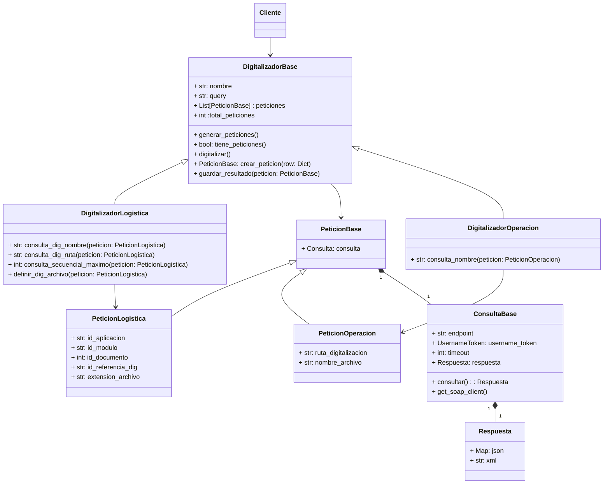

# Diagrama de clases

```mermaid
 classDiagram
        class Cliente{

        }

        class DigitalizadorBase{
            + str: nombre
            + str: query
            + List[PeticionBase] : peticiones
            + int :total_peticiones
            + generar_peticiones()
            + bool: tiene_peticiones()
            + digitalizar()
            + PeticionBase: crear_peticion(row: Dict)
            + guardar_resultado(peticion: PeticionBase)
        }

        class DigitalizadorLogistica{
            + str: consulta_dig_nombre(peticion: PeticionLogistica)
            + str: consulta_dig_ruta(peticion: PeticionLogistica)
            + int: consulta_secuencial_maximo(peticion: PeticionLogistica)
            + definir_dig_archivo(peticion: PeticionLogistica)
        }
        class PeticionLogistica{
            + str: id_aplicacion
            + str: id_modulo
            + int: id_documento
            + str: id_referencia_dig
            + str: extension_archivo
        }

        class PeticionBase{
            + Consulta: consulta
        }

        class DigitalizadorOperacion{
            + str: consulta_nombre(peticion: PeticionOperacion)
        }
        class PeticionOperacion{
            + str: ruta_digitalizacion
            + str: nombre_archivo
        } 
        class ConsultaBase{
            + str: endpoint
            + UsernameToken: username_token
            + int: timeout
            + Respuesta: respuesta
            + consultar(): Respuesta
            + get_soap_client()
        }

        class Respuesta{
            + Map: json
            + str: xml
        }
        
        Cliente-->DigitalizadorBase
        DigitalizadorBase <|-- DigitalizadorLogistica
        DigitalizadorBase --> PeticionBase
        PeticionBase <|-- PeticionLogistica
        DigitalizadorBase <|-- DigitalizadorOperacion
        PeticionBase <|-- PeticionOperacion
        DigitalizadorOperacion --> PeticionOperacion
        DigitalizadorLogistica --> PeticionLogistica
        PeticionBase "1" *-- "1" ConsultaBase
        ConsultaBase "1" *-- "1" Respuesta
```