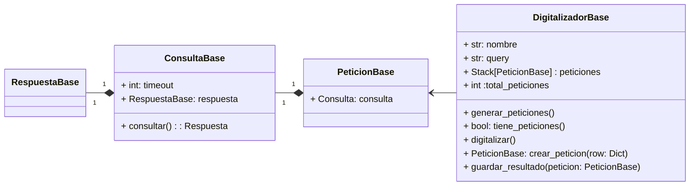
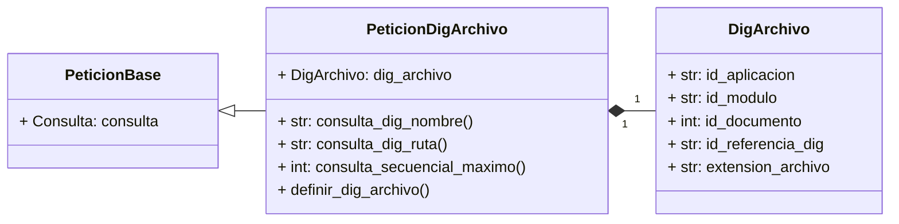
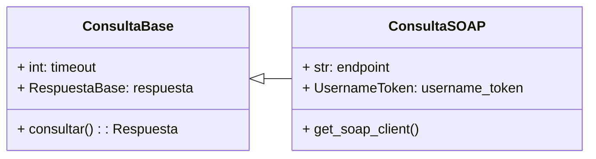
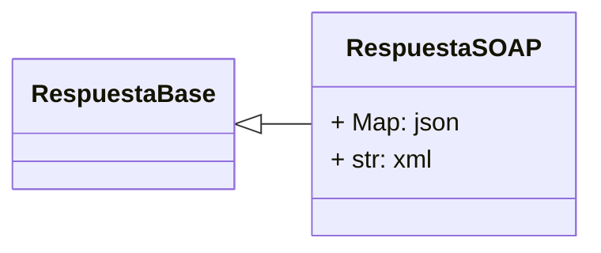

# Diagrama de clases 

## Clases abstractas

```mermaid
 classDiagram
    direction RL
        class DigitalizadorBase{
            + str: nombre
            + str: query
            + Stack[PeticionBase] : peticiones
            + int :total_peticiones
            + generar_peticiones()
            + bool: tiene_peticiones()
            + digitalizar()
            + PeticionBase: crear_peticion(row: Dict)
            + guardar_resultado(peticion: PeticionBase)
        }
     

        class PeticionBase{
            + Consulta: consulta
        }

        class ConsultaBase{
            + int: timeout
            + RespuestaBase: respuesta
            + consultar(): Respuesta
            
        }

        class RespuestaBase{
            
        }
      
 
        DigitalizadorBase --> PeticionBase

        PeticionBase "1" *-- "1" ConsultaBase

        ConsultaBase "1" *-- "1" RespuestaBase

```

## Clases abstractas heredadas por tipo

### Peticiones abstractas 

```mermaid
 classDiagram
direction LR
        class PeticionBase{
            + Consulta: consulta
        }
        class PeticionDigArchivo{
            + DigArchivo: dig_archivo

            + str: consulta_dig_nombre()
            + str: consulta_dig_ruta()
            + int: consulta_secuencial_maximo()
            + definir_dig_archivo()
        }
         class DigArchivo{
            + str: id_aplicacion
            + str: id_modulo
            + int: id_documento
            + str: id_referencia_dig
            + str: extension_archivo
        }

        
        PeticionBase <|-- PeticionDigArchivo
        PeticionDigArchivo "1" *-- "1" DigArchivo

       

```

### Consultas abstractas 

```mermaid
 classDiagram
direction LR
        class ConsultaBase{
            + int: timeout
            + RespuestaBase: respuesta
            + consultar(): Respuesta
            
        }

        class ConsultaSOAP{
            + str: endpoint
            + UsernameToken: username_token
            + get_soap_client()
        }
 
 
        

         
        
        
       

        ConsultaBase <|-- ConsultaSOAP

```

### Respuestas abstractas 

```mermaid
 classDiagram
direction LR

        class RespuestaBase{
            
        }
        class RespuestaSOAP{
            + Map: json
            + str: xml
        }

        RespuestaBase <|-- RespuestaSOAP


```