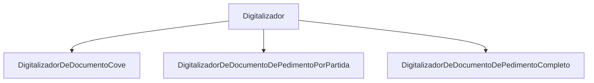
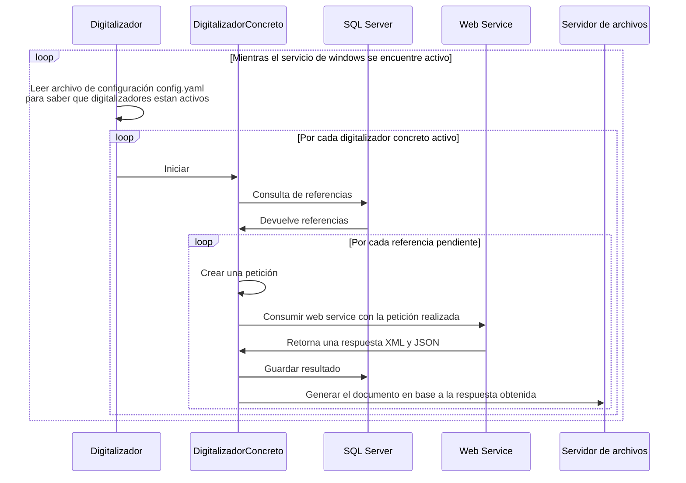

# Introducción

La documentación descrita a continuación hace referencia al nuevo digitalizador y no al digitalizador desarrollado en power builder.

## ¿Qué es?

Entiendase como **digitalizar** al proceso por el cual tiene que pasar un documento para ser generado y a 
**digitalizador** como al conjunto de softwares, algoritmos o tecnologías utilizadas para lograr el proceso de digitalizado. 

Por cada documento existe un **digitalizador concreto** encargado del proceso para generar el documento.

Cuando se hace uso de la palabra digitalizador hacemos referencia a todo ese conjunto de digitalizadores concretos
realacionados a la generación de un documento.  

El digitalizador tiene dos formas de generar documentos:
- A partir del consumo de un web service independiente a Aduasis.
- A partir de un reporte propio de Aduasis tipo Jasper.

## Funcionamiento

A grandes rasgos, el digitalizador consta de un archivo de configuración de tipo YAML en
donde específicamos la cadena de conexión a la base de datos, parámetros para la consulta
a los web services, opción para apagar y encender digitalizadores y opciones para el guardado
de logs. Así mismo consta de de un motor que es ejecutado en el background del sistema operativo
en forma de servicio de windows y lleva a cabo el siguiente proceso de forma recurrente:

## Documentos soportados

### Propios de Aduasis
| Nombre |  Nombre Jasper | SP utilizado |
 | --- | --- | --- |
 | Cove PDF | documentoCovePDF.jasper | up_reporteDocumentoCove | 

### Dependientes de Web Services

| Nombre |  Horario | Web Service endpoint |
 | --- | --- | --- |
 |  Acuse Cove | 24/7 | https://www.ventanillaunica.gob.mx:443/ventanilla-acuses-HA/ConsultaAcusesServiceWS |
 | Acuse eDocument | 24/7 | https://www.ventanillaunica.gob.mx:443/ventanilla-acuses-HA/ConsultaAcusesServiceWS |
 | XML Pedimento   | 24/7 | https://www.ventanillaunica.gob.mx:443/ventanilla-ws-pedimentos/ConsultarPedimentoCompletoService |
 | XML Cove  | 24/7 | (Pendiente de compartir) |
 | XML eDocumen  | 10pm-6am | https://www.ventanillaunica.gob.mx:443/Ventanilla-HA/ServicioEdocument/ServicioEdocument.svc |
 | PDF eDocument  | 10pm-6am | https://www.ventanillaunica.gob.mx:443/Ventanilla-HA/ServicioEdocument/ServicioEdocument.svc |

