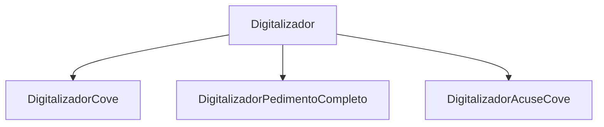
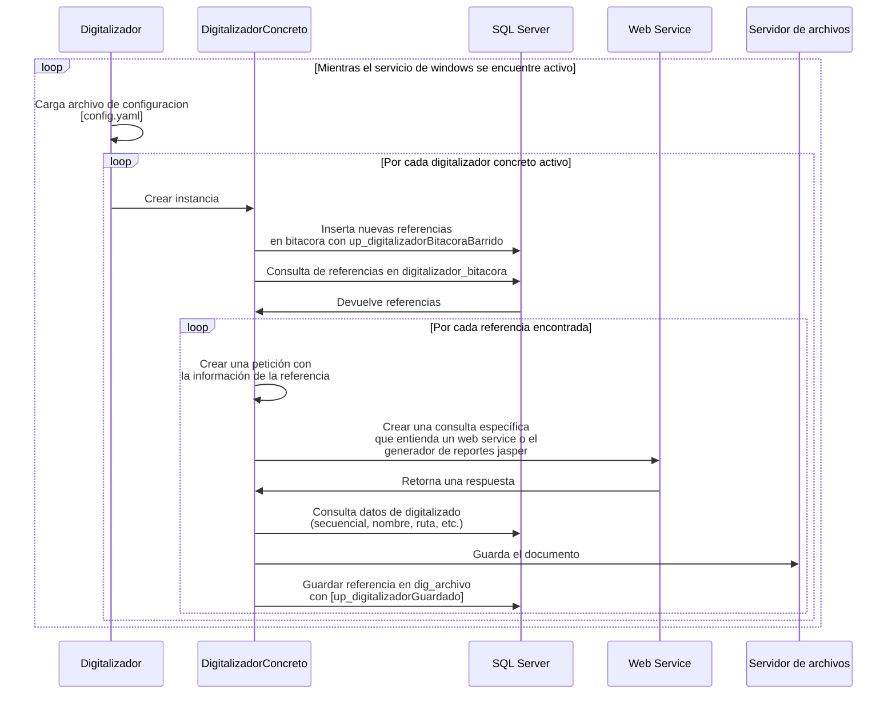

# Introducción

La documentación descrita a continuación hace referencia al nuevo digitalizador y no al digitalizador desarrollado en power builder.

## ¿Qué es?

Entiendase como **digitalizar** al proceso por el cual tiene que pasar un documento para ser generado y a 
**digitalizador** como al conjunto de softwares, algoritmos o tecnologías utilizadas para lograr el proceso de digitalizado. 

Por cada documento existe un **digitalizador concreto** encargado del proceso para generarlo.

El digitalizador tiene dos formas de generar documentos:
- A partir del consumo de un web service independiente a Aduasis.
- A partir de un reporte propio de Aduasis tipo Jasper.

## Funcionamiento

A grandes rasgos, el digitalizador es un proceso ejecutado en el background en forma de servicio
de windows, el cual es apoyado de un archivo de configuración tipo YAML en donde se específican
parametros como la cadena de conexión a la base de datos, parámetros para la consulta
a los web services, opción para apagar y encender digitalizadores y opciones para el guardado
de logs. 

El diagrama de secuencia sería el siguiente:

## Documentos soportados dependientes de web services

| Nombre | ID |  Horario | Web Service endpoint | SP para buscar referencias |
 | --- | --- | --- | --- | --- |
 |  Acuse Cove | 72 |24/7 | https://www.ventanillaunica.gob.mx:443/ventanilla-acuses-HA/ConsultaAcusesServiceWS | up_digitalizadorAcuseCovePDF | |
 | Acuse eDocument | 73 |24/7 | https://www.ventanillaunica.gob.mx:443/ventanilla-acuses-HA/ConsultaAcusesServiceWS | up_digitalizadorAcuseEDocumentPDF| 
 | XML Pedimento   | 76 |24/7 | https://www.ventanillaunica.gob.mx:443/ventanilla-ws-pedimentos/ConsultarPedimentoCompletoService | up_digitalizadorPedimentoCompletoXML |
 | XML Cove  | 77 |24/7 | https://www.ventanillaunica.gob.mx:443/ventanilla/ConsultarEdocumentService| up_digitalizadorCoveXML|
 | XML eDocumen  | |10pm-6am | https://www.ventanillaunica.gob.mx:443/Ventanilla-HA/ServicioEdocument/ServicioEdocument.svc | Pendiente |
 | PDF eDocument  | |10pm-6am | https://www.ventanillaunica.gob.mx:443/Ventanilla-HA/ServicioEdocument/ServicioEdocument.svc | Pendiente|

## Documentos soportados propios de Aduasis
| Nombre | ID |  Nombre(s) Jasper | SP(s) | Recursos estaticos |
 | --- | --- | --- | --- | --- |
 | Cove PDF | 25 |cove_reporte.jasper, cove_reporte_mercancias.jasper, cove_reporte_mercancias_modelos.jasper | up_digitalizadorCovePDF.sql, up_reporteCoveMercanciasModelosPDF ,up_reporteCoveMercanciasPDF , up_reporteCovePDF.sql | footer.png, header.png| 

